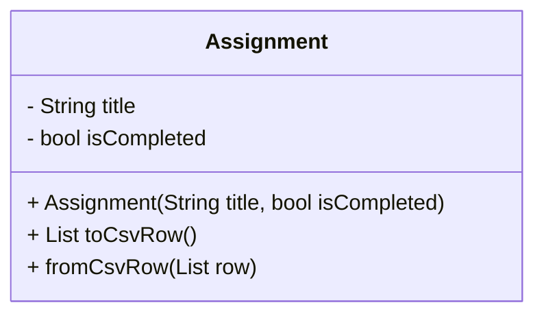
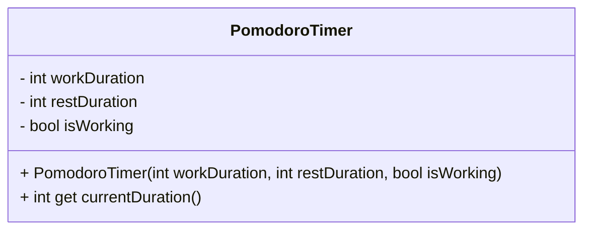

# Study Wizard

## 🎀 Project Summary

**୨୧** This project was created as a study tool targeted towards students to track and save their assignments, as well as to monitor their progress during a study session. The Windows app contains three pages: the home page, the assignment page, and the pomodoro page. It also has an assignment tracker and a pomodoro timer embedded into the study tool. A user can interact with the app by adding, deleting, and editing assignments, beginning and switching the timers, and checking off items. As this project progresses, more features will be added.


## 🎀 Design and Architecture

**୨୧** While the mermaid diagrams of both the assignment and pomodoro classes are contained in mermaid.md, they can also be seen here.

### ⋆˙⟡ Assignment Class Mermaid Diagram

---



### ⋆˙⟡ Pomodoro Class Mermaid Diagram

---




## 🎀 Instructions

**୨୧** To use the app, create a folder, and set up [Flutter](https://flutter.dev/?utm_source=google&utm_medium=cpc&utm_campaign=brand_sem&utm_content=na_us&gad_source=1&gbraid=0AAAAAC-INI_9sR-MNn8EWTv4wsWtBLP0D&gclid=Cj0KCQjw_JzABhC2ARIsAPe3ynpU0p3h6QkbvtOmAOR6ccz-gtUbnDOpW5n_1ZrlAbYWb9cLWwZE3X0aAiIIEALw_wcB&gclsrc=aw.ds). After flutter is set up in the folder, the main.dart file as well as  the folders can be pasted inside the your_folder\lib file. After the command ```flutter run``` is used inside the terminal, the project can be used. Due to the saving capabilities, if the window is closed, the project will save data.

**୨୧** This was created and tested in Visual Studio Code. It was tested manually. After every addition to the project, it was manually tested to ensure that the app worked properly.


## 🎀 Challenges, The Role of AI, Insights

**୨୧** Some challenges included code formatting. While I had created a project that had a beautiful UI, the code was messy, so I restarted, creating a new project with organized code. The old code was scrapped. The new project's wireframe was created using AI, and it was debugged and edited, as needed, manually. The biggest learning curve that I had during this project was how to write clean code, especially in a language that I had barely used before this project. It took a little bit to overcome, but I am proud of the project that came out of it.


## 🎀 Next Steps

**୨୧** Some next steps will include creating a better, smoother UI. There will be options added to sort assignments. Another addition is a rewards system where for every completed assignment will be given a reward. Further, there will be an option to adjust the timers on the Pomodoro page. There will also be upcoming assignments on the homepage, as well as more options for tests and projects when creating assignments. We all are our own worst critics, so there are infinite aspects that I would  love to gradually improve as time allows.
