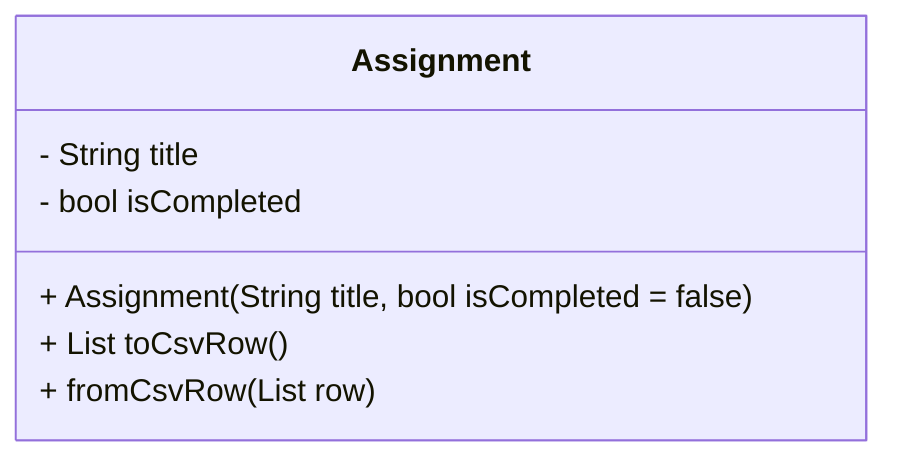
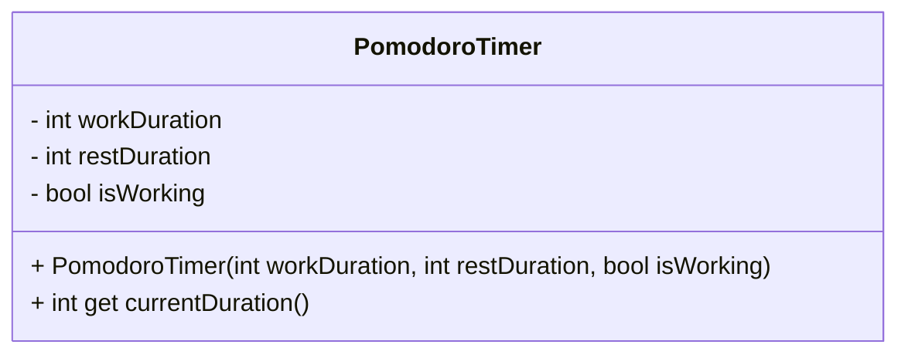

### Assignment_Model Mermaid Diagram

---

```mermaid
classDiagram
  class Assignment {
    - String title
    - bool isCompleted
    + Assignment(String title, bool isCompleted = false)
    + List<String> toCsvRow()
    + fromCsvRow(List<dynamic> row)
  }
```

### Timer_Model Mermaid Diagram

---

```mermaid
classDiagram
  class PomodoroTimer {
    - int workDuration
    - int restDuration
    - bool isWorking
    + PomodoroTimer(int workDuration, int restDuration, bool isWorking)
    + int get currentDuration()
  }
```
